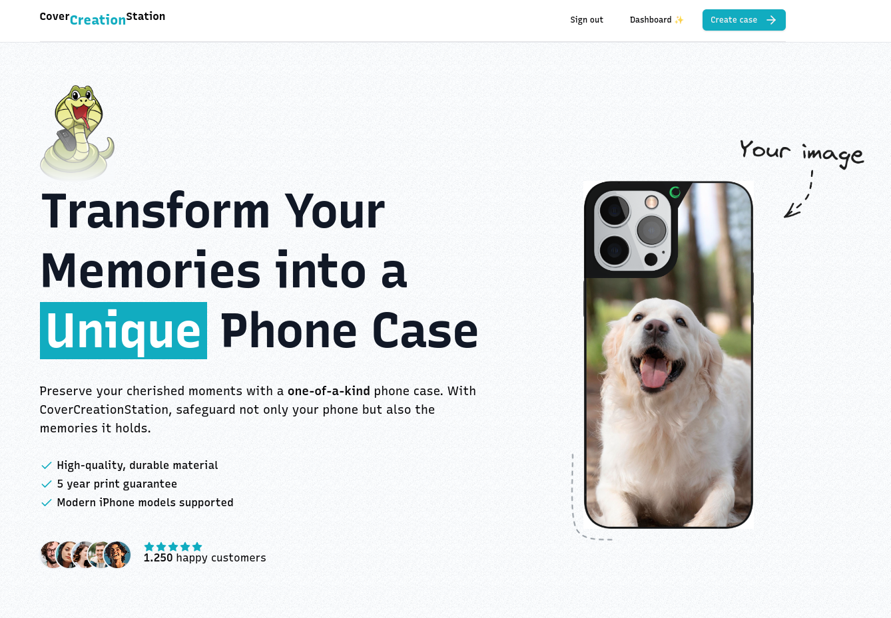
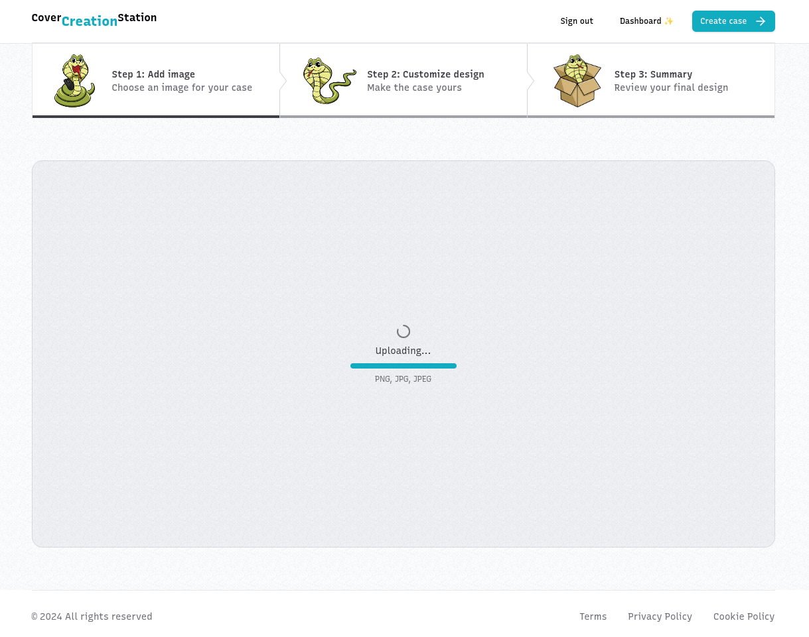
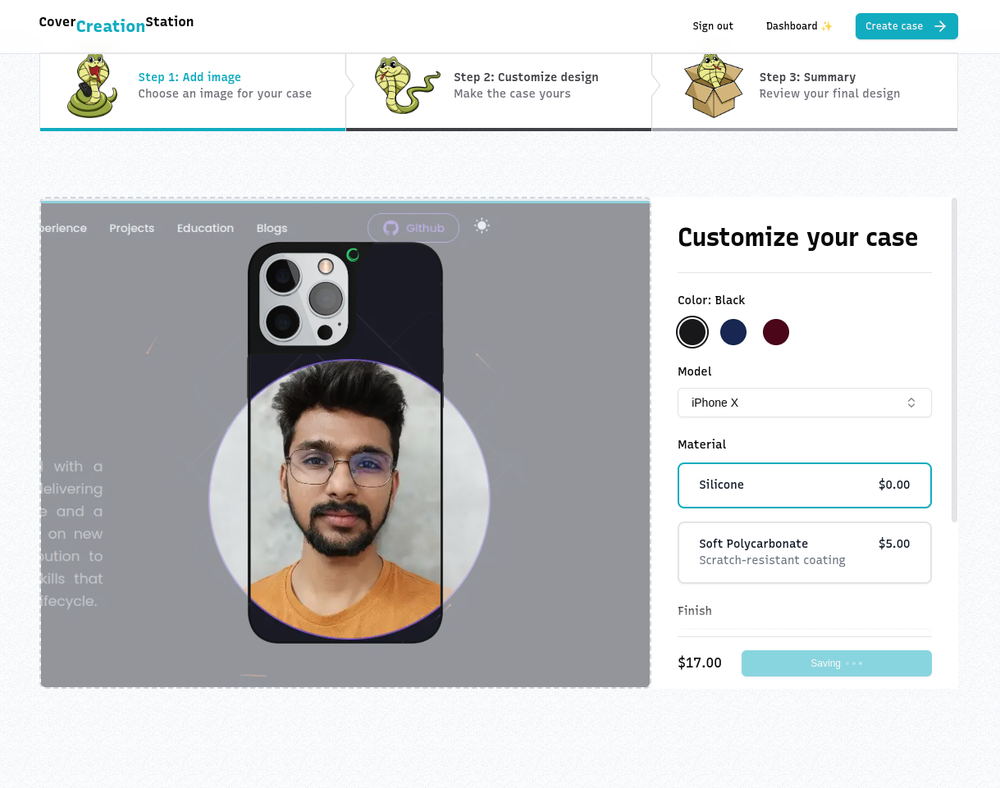
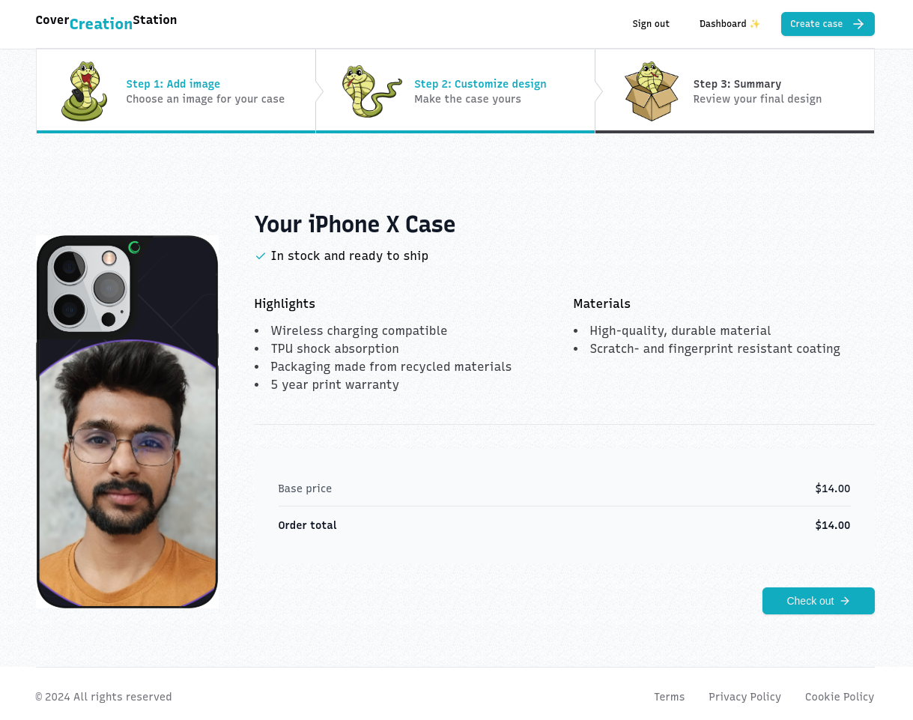
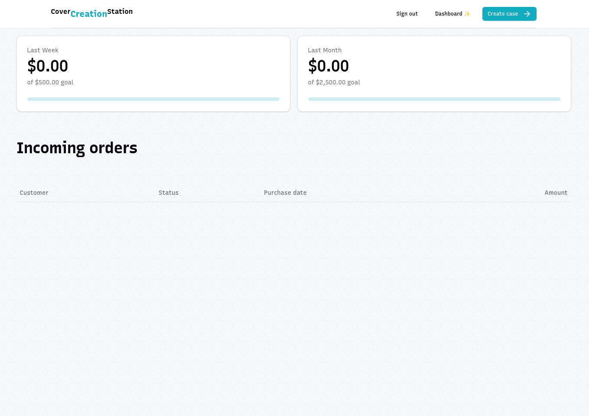

# CoverCreationStation

## Introduction

Built with the Next.js 14 App Router, TypeScript, Tailwind, Kinde for Auth, Neon for Postgres database, Uploadthing for File uploading, Prisma as the ORM & Stripe for Payment processing

## Features

- **Kinde**: Authentication and authorization provider.
- **Uploadthing**: File uploading service.
- **Neon**: Hosted PostgreSQL database.
- **Prisma**: ORM for database interaction.
- **Stripe**: Payment processing service.

## Prerequisites

- Node.js (v14.x or later)
- npm (v6.x or later) or yarn (v1.x or later)

## Installation

1. Clone the repository:

   ```bash
   git clone https://github.com/jimmy-ramani-0912/Cover-Creation-Station
   cd Cover-Creation-Station
   ```

2. Create a .env file in the root directory of your project and add the following environment variables:

```
# Retrieved from our auth provider Kinde
KINDE_CLIENT_ID=
KINDE_CLIENT_SECRET=
KINDE_ISSUER_URL=
KINDE_SITE_URL=http://localhost:3000
KINDE_POST_LOGOUT_REDIRECT_URL=http://localhost:3000
KINDE_POST_LOGIN_REDIRECT_URL=http://localhost:3000/

NEXT_PUBLIC_SERVER_URL=http://localhost:3000

# Retrieved from our payment provider Stripe
STRIPE_SECRET_KEY=
STRIPE_WEBHOOK_SECRET=

# Retrieved from file uploading service Uploadthing
UPLOADTHING_SECRET=
UPLOADTHING_APP_ID=

# Retrieved from our hosted database at Neon.tech
DATABASE_URL=

# (optional) Your email to access the secret admin dashboard
ADMIN_EMAIL=

# (optional) Retrieved from email sending service Resend
RESEND_API_KEY=
```

## Running the project

1. Start the development server:

```
npm run dev
or
yarn dev
```

2. Open http://localhost:3000 with your browser to see the result.

## Output










